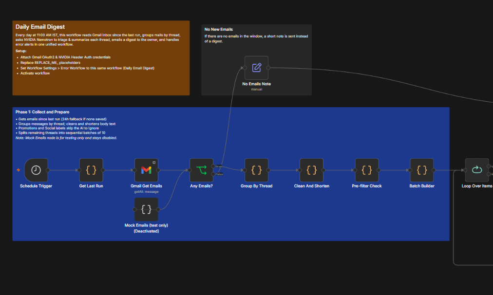
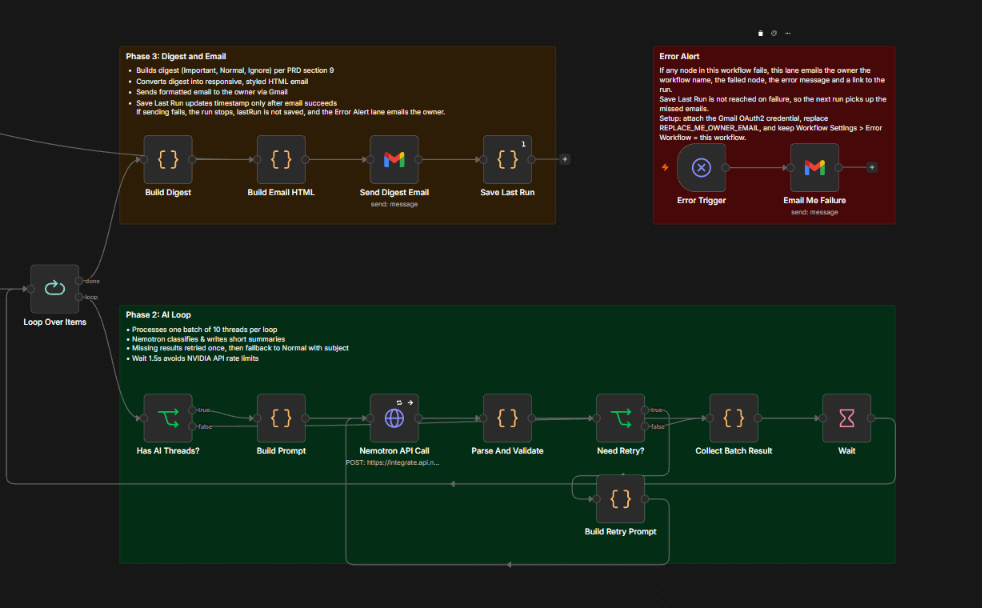
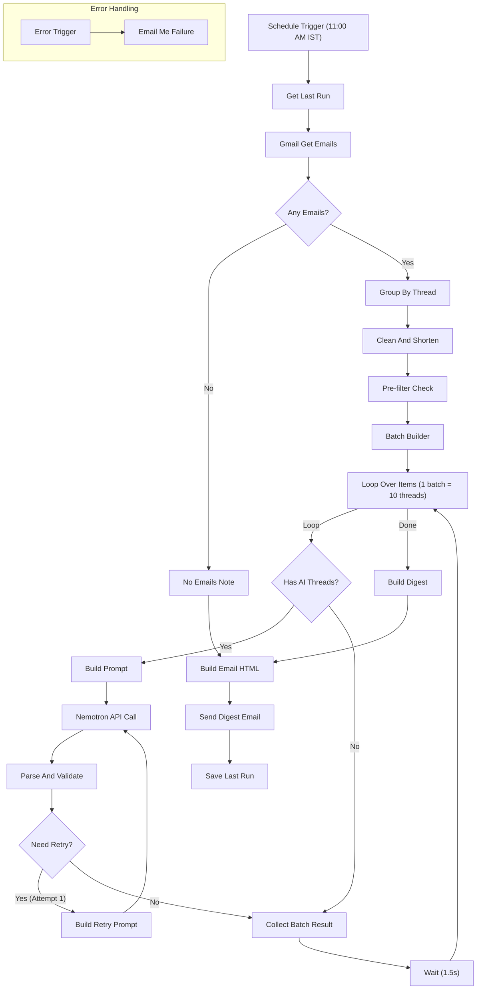

# n8n Daily Email Summarizer

An automated n8n workflow that collects, classifies, and summarizes daily Gmail inbox activity into a structured, responsive HTML digest using NVIDIA Nemotron.




## What It Does

Every day at 11:00 AM IST, the workflow reads the owner's Gmail inbox since the last successful run, groups incoming messages by thread, classifies each thread as **Important**, **Normal**, or **Ignore** using NVIDIA Nemotron (processed in batches of 10 threads per API call), and emails a single formatted HTML digest directly to the owner's Gmail inbox.

## Features

- **Batching**: Threads are processed sequentially in batches of 10, requiring only ~1 AI call per 10 threads.
- **Promotions and Social Pre-filter**: Messages labeled `CATEGORY_PROMOTIONS` or `CATEGORY_SOCIAL` skip the AI call entirely and route straight to the Ignore section with their subject line.
- **Retry with Guaranteed Fallback**: Missing or invalid AI responses are retried once; any remaining missing items fall back to Normal with their subject line as the summary. No thread is ever silently dropped.
- **Dynamic Last-Run Window**: Reads the timestamp saved from the previous successful run. If a run fails, the timestamp is not updated, ensuring missed emails are picked up on the next run without data loss.
- **Built-in Error Alert**: Contains an integrated `Error Trigger` and `Email Me Failure` lane on the canvas to immediately alert the owner via Gmail if any step fails.
- **Busy-Day Cap**: When 60 or more threads arrive in a single day, the Normal and Ignore sections are capped at 10 items each (with a `+N more` counter), while Important items are never truncated.

## How It Works

1. **Schedule Trigger**: Fires daily at 11:00 AM Asia/Kolkata time.
2. **Window & Fetch**: `Get Last Run` calculates the epoch time range since the last successful run (24-hour fallback on first run or test), and `Gmail Get Emails` retrieves all messages in that window.
3. **Empty Check**: If zero emails arrive, `No Emails Note` routes directly to `Build Email HTML` to deliver a brief notification email.
4. **Group & Clean**: `Group By Thread` aggregates messages by `threadId` and extracts sender metadata; `Clean And Shorten` strips HTML, signatures, and reply quotes, shortening latest text to 800 characters and earlier text to 300 characters.
5. **Pre-filter & Batch**: `Pre-filter Check` flags promotional/social emails, and `Batch Builder` creates sequential batches of up to 10 threads.
6. **AI Loop**: For each batch, `Build Prompt` formats the threads into a structured prompt, calls NVIDIA Nemotron (`Nemotron API Call`), and `Parse And Validate` extracts the JSON. If items are missing on attempt 1, `Need Retry?` triggers `Build Retry Prompt` for a second attempt. `Wait` introduces a 1.5-second delay between batches to respect rate limits.
7. **Digest & HTML**: `Build Digest` merges all batch results, applies busy-day capping, and `Build Email HTML` renders a responsive HTML email with color-coded section cards and direct Gmail links.
8. **Delivery & Persistence**: `Send Digest Email` delivers the digest to the owner via Gmail. Upon successful delivery, `Save Last Run` stores the current timestamp in workflow static data.
9. **Error Alert Lane**: If any failure occurs during execution, `Error Trigger` activates `Email Me Failure` to dispatch an error report with the failed node and execution link.

### Workflow Pipeline



## Digest Layout

The generated HTML digest organizes email threads into three clean, color-coded sections:

### 🔴 Important Section
Items requiring direct action, deadlines, monetary transactions, or personal communications. Each item displays the sender, received time, reply/file counts, a concise AI summary, a distinct action banner, and a direct link to the thread in Gmail.

```text
1. HDFC Bank · Wed 10:15 AM · 1 file
   Card payment of ₹4,500 is due 3 Oct. Pay to avoid a late fee.
   Action: Pay by 3 Oct
   [Open in Gmail]
```
*(If no items are marked important, displays: `Nothing needs you today.`)*

### 🟡 Normal Section
Informational emails requiring no immediate action. Displays sender, time, and summary in chronological order (newest first).

```text
• Swiggy · 9:45 AM — Your Swiggy order has been delivered.
• BESCOM · Wed 8:30 AM — Electricity bill for September has been generated.
```

### ⚪ Ignore Section
Automated notifications, newsletters, marketing updates, and promotional items skipped by rule.

```text
Amazon: Big sale today
Swiggy: 50% off next order
Quora: Your daily digest
```

## Requirements

- **n8n**: Recent n8n 1.x (tested on n8n 1.x)
- **Gmail Account**: OAuth2 connection for reading inbox messages and sending digests/error alerts.
- **NVIDIA API Key**: API key from [integrate.api.nvidia.com](https://integrate.api.nvidia.com).
- **Optional**: Google Antigravity + n8n MCP if you want to rebuild or customize the workflow programmatically.

## Setup

1. **Import Workflow**:
   - In n8n, navigate to **Workflows** > **Add Workflow** > **Import from File...** and select [`workflow/daily-email-digest.json`](workflow/daily-email-digest.json).
2. **Gmail OAuth2 Credential**:
   - Create a Gmail OAuth2 credential in n8n with read and send permissions.
   - Attach this credential to three nodes: `Gmail Get Emails`, `Send Digest Email`, and `Email Me Failure`.
3. **NVIDIA Header Auth Credential**:
   - Create an n8n **Header Auth** credential.
   - Set Header Name: `Authorization`
   - Set Header Value: `Bearer <your NVIDIA API key>`
   - Attach this credential to `Nemotron API Call`.
   - *Never commit your actual API keys, tokens, or credential files to version control.*
4. **Replace Placeholders**:
   - In `Send Digest Email`, replace `REPLACE_ME_OWNER_EMAIL` in the **To** field with your personal Gmail address.
   - In `Email Me Failure`, replace `REPLACE_ME_OWNER_EMAIL` in the **To** field with your personal Gmail address.
5. **Workflow Settings**:
   - Open Workflow Settings (gear icon in the top right canvas menu).
   - Set **Timezone** to `Asia/Kolkata`.
   - Set **Error Workflow** to this same workflow (`Daily Email Digest`).
6. **Activate**:
   - Toggle the workflow switch to **Active**. (Active mode is required for the schedule trigger to execute and for static data timestamps to persist).

## Configuration Reference

| Parameter | Value | Description |
|---|---|---|
| Schedule | Daily at 11:00 AM | Configured in `Schedule Trigger` |
| Timezone | `Asia/Kolkata` (IST) | Set in `Schedule Trigger` and Workflow Settings |
| Batch Size | 10 threads | Configured in `Batch Builder` |
| Model | `nvidia/nemotron-3-ultra-550b-a55b` | Specified in `Build Prompt` and `Build Retry Prompt` |
| Temperature | `0.1` | Low temperature ensures deterministic, factual output |
| Max Tokens | `3000` | Token limit per batch completion |
| Wait Delay | `1.5s` (or 2s) | Inter-batch delay in `Wait` node to respect API rate limits |
| Busy-Day Cap | $\ge 60$ threads | In `Build Digest`: caps Normal & Ignore at 10 items each |
| Pre-filter Labels | `CATEGORY_PROMOTIONS`, `CATEGORY_SOCIAL` | Evaluated in `Pre-filter Check` to bypass AI calls |

## Testing

- **Mock Emails (test only)**: A disabled Code node positioned under `Gmail Get Emails` contains 31 mock Gmail-shaped message payloads (27 normal threads and 4 promotional/social threads). To test the workflow without accessing live Gmail, connect `Mock Emails (test only)` to `Any Emails?` and run a manual test.
- **Manual Runs vs Static Data**: Static data (`$getWorkflowStaticData('global').lastRun`) is saved **only** during automated production executions when the workflow is active. During manual canvas runs, static data is not saved, so `Get Last Run` automatically defaults to the last 24 hours.
- **Error Trigger Testing**: The `Error Trigger` node only fires during production executions when the workflow is active; it does not fire during manual canvas test runs.

## Error Handling

| Situation | Workflow Behaviour |
|---|---|
| Gmail Get Emails fails | Node retries; workflow stops; `Error Trigger` emails failure alert. `lastRun` timestamp is not saved. |
| Zero emails in window | `Any Emails?` routes to `No Emails Note`; a clean notification email is sent; `lastRun` timestamp is saved. |
| All threads are Promotions/Social | `Batch Builder` creates batch 1 with `threads: []`; `Has AI Threads?` skips the API call; digest contains only the Ignore section. |
| Nemotron HTTP error or timeout | HTTP Request retries up to 3 times; if still failing, all threads in the batch are marked missing, retried once, then fall back to Normal with subject line. |
| Malformed or partial JSON | Valid items are preserved; missing IDs are retried once in attempt 2; remaining items fall back to Normal with subject line. |
| Send Digest Email fails | Workflow execution halts immediately; `Save Last Run` is not reached; `Error Trigger` sends failure alert. Missed emails are retrieved on the next run. |

## Privacy and Data Handling

- Cleaned email text (~1100 characters per thread: 800 characters from newest message and 300 characters from earlier messages) is sent to NVIDIA as is.
- No client-side masking (e.g. for account numbers, OTPs, or sensitive information) is performed.
- Do not use this workflow on mailboxes with sensitive or confidential data that you cannot share with external AI services.

## Limitations and Troubleshooting

- **Promotions / Social Categorization**: Gmail label categorization is heuristic; occasionally an important email categorized by Gmail under Promotions will be skipped by rule to the Ignore section.
- **Long Threads**: Only the latest 800 characters and older 300 characters are sent to the AI; very lengthy threads will have inner context truncated.
- **Attachment Processing**: Only attachment counts and filenames are inspected; attachment binary contents are neither downloaded nor analyzed.
- **Duplicate Execution Warning**: Ensure the workflow is activated only once to avoid duplicate email digests.

## Project Structure

```text
n8n-daily-email-summarizer/
├── .gitignore
├── LICENSE
├── README.md
├── docs/
│   └── PRD.md
├── img/
│   ├── workflow-phase1.png
│   └── workflow-phase2.png
└── workflow/
    └── daily-email-digest.json
```

## License

Distributed under the [MIT License](LICENSE). Copyright (c) 2026 aryankumar-04.
